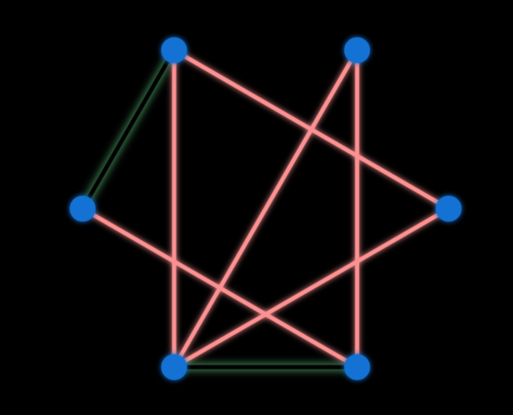
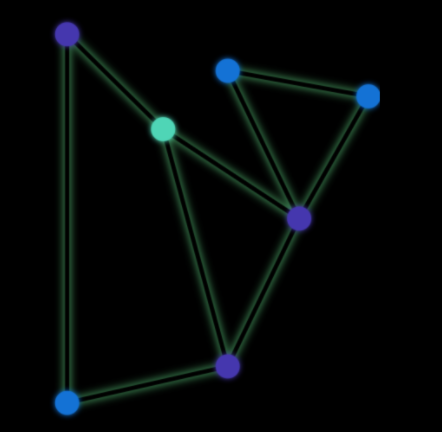

##Introdução
O presente documento tem o objetivo de apresentar as características do desenvolvimento de um jogo utilizando técnicas de estrutura de dados grafo. No mesmo documento será apresentado as técnicas utilizadas para o desenvolvimento, assim como, as tecnologias para que seja compartilhado o conhecimento com outros acadêmicos. Logo em seguida será apresentado um relatório de acompanhamento durante o desenvolvimento do jogo.

##Sobre o Jogo
O jogo será desenvolvido utilizando a linguagem javascript, sendo apresentado em um navegador, onde todos com um computador, internet e o navegador em si possam acessar. O jogo será produzido aplicando as técnicas de grafo planar definido como "um grafo que pode ser imerso no plano de tal forma que suas arestas não se cruzem, esta é uma idealização abstrata de um grafo plano, um grafo plano é um grafo planar que foi desenhado no plano sem o cruzamento de arestas".

O objetivo do jogo será arrastar os vértices de grafos não planares até que os mesmos se tornem grafos planares. Assim que o objetivo é atingido, o jogador ganha pontos e passa para o próximo nível, onde a dificuldade aumenta, sendo a mesma representada pelo aumento do número de vértices com o qual o jogador interage.

##Relatórios

| Data       | Realizado                                                                                     | Dificuldades                                                 |
|------------|-----------------------------------------------------------------------------------------------|--------------------------------------------------------------|
| 29/11/2017 | Início de estudo sobre o tipo de jogo que será feito                                          | -                                                            |
| 04/12/2017 | Definição e início de desenvolvimento de jogo                                                 | Fórmula para cálculo de validação para interseção de arestas |
| 06/12/2017 | Orientador relembrou o conceito de grafo planar o qual será aplicado como solução para o jogo | -                                                            |
| 09/12/201  | Finalização de interface do jogo e testes                                                     | -                                                            |
| 10/12/2017 | Finalização do projeto de jogo                                                                | -                                                            |
| 11/12/2017 | Apresentação                                                                                  | -                                                            |

##Conclusão

Durante o desenvolvimento do jogo foram encontradas dificuldades em relação a tecnologia a qual seria aplicada, além de conhecimentos específicos para resolução do problema de interseção das arestas do grafo. Foi muito importante a orientação do professor em relação aos desafios apresentados, pois o mesmo contribuiu para encontrar caminhos os quais auxiliaram no avanço do projeto.

Para quem tem interesse no desenvolvimento de jogos, é importante ressaltar o quanto é divertido, pois se tem a experiência de criar histórias e desafios em que o próprio desenvolvedor pode explorar, sendo uma área que ajuda no aprendizado do próprio criador e de outras pessoas que irão desfrutar do jogo desenvolvido. O fato é que vale a pena explorar a área, que embora seja desafiadora, é muito divertida.

É interessante também evidenciar que foi importante o conhecimento prévio das bases da disciplina de estrutura de dados, onde teve sua utilidade através de técnicas que facilitam a resolução de problemas complexos.
